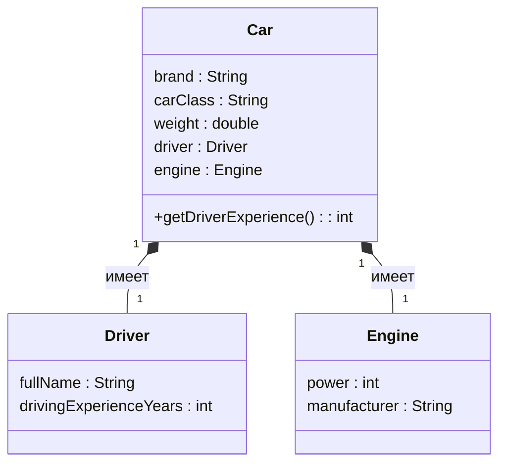

# UML-диаграмма классов для проекта "Автомобиль"

```mermaid
classDiagram
    direction TB
    
    class Driver {
        fullName : String
        drivingExperienceYears : int
    }

    class Engine {
        power : int
        manufacturer : String
    }

    class Car {
        brand : String
        carClass : String
        weight : double
        driver : Driver
        engine : Engine
        +getDriverExperience() : int
    }

    Car "1" *-- "1" Driver : имеет
    Car "1" *-- "1" Engine : имеет
```